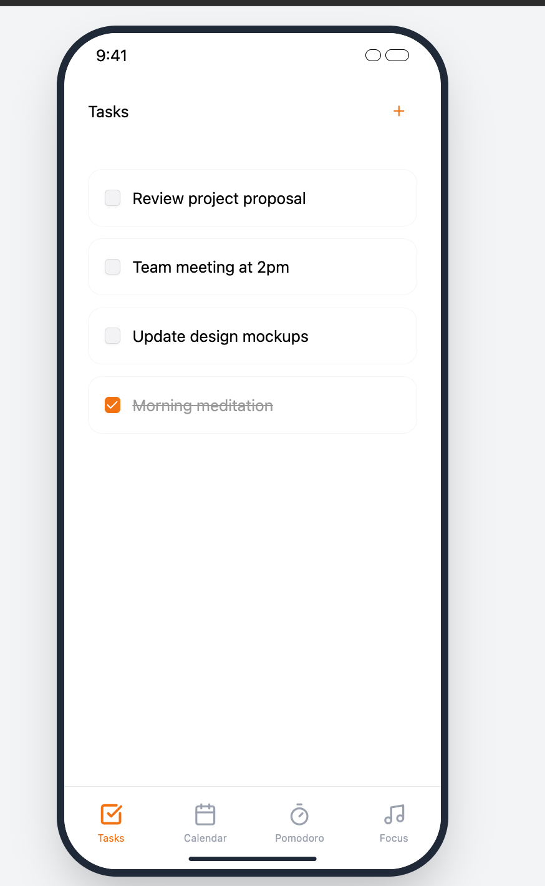
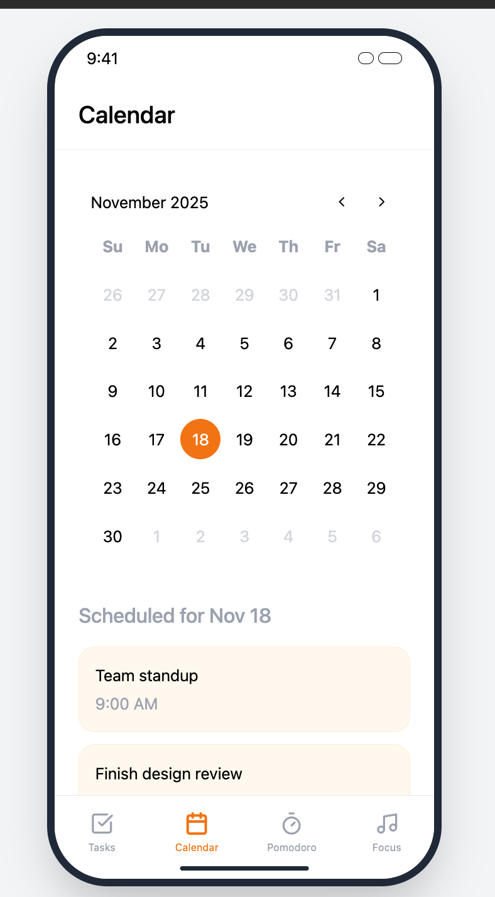
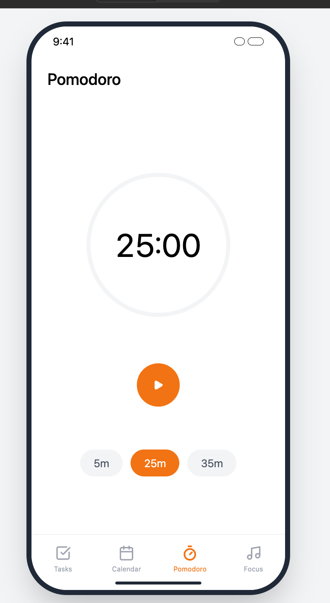
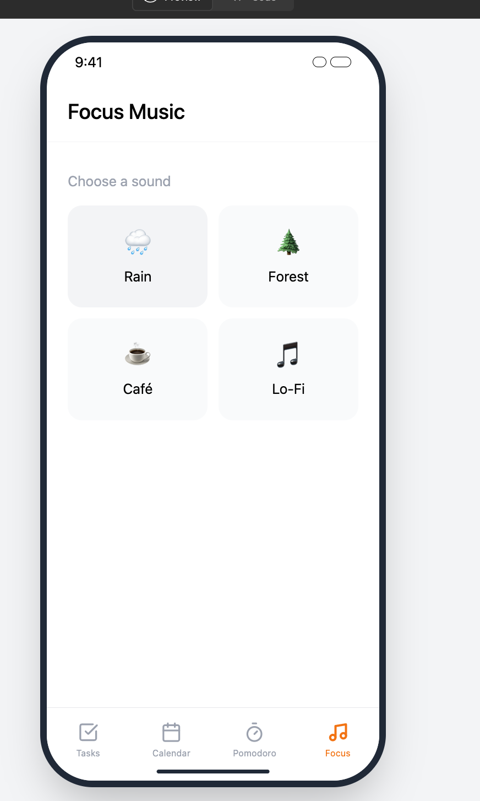

# ProductivityHub

## Table of Contents

1. [Overview](#Overview)
2. [Product-Spec](#Product-Spec)
3. [Wireframes](#Wireframes)
4. [Schema](#Schema)

---

## Overview

### Description

**ProductivityHub** is an all-in-one personal productivity app designed to help users **plan, focus, and achieve their goals** efficiently. It combines four essential tools — **Task Manager**, **Calendar**, **Pomodoro Timer**, and **Focus Music Player** — into one seamless experience.

The goal is to help students and professionals manage their time, reduce distractions, and build consistent habits that improve overall productivity and well-being.

---

### App Evaluation

- **Category:** Productivity / Lifestyle  
- **Mobile:** iOS (iPhone) — fully responsive UIKit app  
- **Story:** Users can manage daily tasks, track upcoming events, focus using Pomodoro sessions, and improve concentration with ambient focus sounds.  
- **Market:** Designed for students, remote workers, and productivity enthusiasts.  
- **Habit:** Encourages daily task planning, focused work sessions, and mindfulness habits through music and timers.  
- **Scope:**  
  - MVP includes 4 fully functional tabs: Tasks, Calendar, Pomodoro, and Focus Music.  
  - Future expansions could include analytics, user authentication, and cloud syncing.

---

## Product Spec

### 1. User Stories (Required and Optional)

#### ✅ Required Must-have Stories
- [x] User can **create, edit, and delete tasks**.  
- [x] User can **mark tasks as complete/incomplete**.  
- [x] User can **view a calendar** with upcoming events.  
- [x] User can **start a Pomodoro timer**, pause/reset it, and visually track progress with a circular progress indicator.  
- [x] Timer automatically congratulates the user upon completion and suggests a break.  
- [x] User can **swipe a task** to start a Pomodoro for that specific task.  
- [x] User can access the **Focus Music tab** to play ambient sounds (Rain 🌧, Forest 🌲, Café ☕, Lo-Fi 🎧).

#### 💡 Optional things to implement later
- [ ] Auto-cycle Pomodoro sessions (Work → Short Break → Long Break).  
- [ ] Habit tracker dashboard with streak visualization.  
- [ ] Daily/Weekly productivity statistics.  
- [ ] Custom sound uploads or playlists for Focus Music.  
- [ ] Push notifications for task deadlines and hydration reminders.

---

### 2. Screen Archetypes

#### 🗒 Tasks Screen
- View all current and completed tasks.  
- Add new tasks or edit existing ones.  
- Swipe left on a task to start a Pomodoro session.

#### 🗓 Calendar Screen
- Displays user’s planned events or upcoming deadlines.  
- Helps users visually manage their schedule.

#### ⏱ Pomodoro Screen
- Displays countdown timer.  
- Visual progress ring animation.  
- Customizable session durations (5, 30, 35 minutes).  
- “Congrats! You’ve earned a 10-minute break” alert after completion.

#### 🎧 Focus Music Screen
- Lists available sound options: Rain, Forest, Café, Lo-Fi.  
- Allows play/pause toggle per sound.  
- Designed with minimal UI for distraction-free experience.

---

### 3. Navigation

#### Tab Navigation (Main Screens)
- 🗒 **Tasks** – Task Manager  
- 🗓 **Calendar** – Daily/Weekly overview  
- ⏱ **Pomodoro** – Focus Timer  
- 🎧 **Focus Music** – Ambient Sound Player  

#### Flow Navigation (Screen to Screen)
- Tasks → Task Compose Screen → Save/Cancel  
- Tasks → Swipe → Pomodoro Tab  
- Pomodoro → Alert → Back to Tasks or Continue  
- Focus Music → Tap sound → Play/Pause

---

## Wireframes

---

## Schema

### Models

Since this is a local data app (not API-based), models are stored locally using `UserDefaults` or similar storage.

| Property | Type | Description |
|-----------|------|-------------|
| `title` | String | Task name |
| `isComplete` | Bool | Whether the task is completed |
| `createdDate` | Date | When the task was created |
| `completedDate` | Date? | When the task was completed |
| `taskID` | String | Unique identifier for each task |
| `duration` | Int | Pomodoro duration (in seconds) |
| `selectedSound` | String | Currently active focus sound |

---

### Networking

This app is **offline-first** — all data is stored locally on the device.  
Future versions could connect to an API for syncing across devices.

Possible future API endpoints:

| HTTP Method | Endpoint | Description |
|--------------|-----------|-------------|
| GET | `/tasks` | Fetch all tasks |
| POST | `/tasks` | Create new task |
| PUT | `/tasks/:id` | Update existing task |
| DELETE | `/tasks/:id` | Delete task |
| GET | `/stats` | Fetch productivity stats |

---

## 📹 Demo Video

🎥 **Loom or YouTube Link:**  

    
    
  

---

## 🚀 Sprint Plan

| Sprint | Goal |
|---------|------|
| Brainstorming, app idea, wireframes | ✅ Done |
| Implement Tasks, Calendar, Pomodoro UI | ✅ Done |
| Add Focus Music player & polish UI | ✅ Done |
| Testing, README update, video submission |✅ Done |

---

## 🏁 Author
**Harshit Aggarwal**  
University of Illinois Chicago  
CS Student | iOS Developer | Passionate about productivity and clean design

